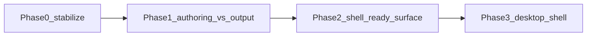

# Polyphonia / PETS — roadmap модернизации

Каноническая копия плана в репозитории (для QA change gate и ссылок из `tasks/`). Оригинал в Cursor: `расширение_чат_и_рифф_be126a43.plan.md` — при существенных правках синхронизировать оба места.

## Чеклист треков (кратко)

| ID | Трек | Статус (2026-04-23) |
|----|------|---------------------|
| decide-variant | Вариант A/B/C/D + политика LLM | **done** — `tasks/assist-variant-decision.md` |
| riff-contract | JSON-контракт риффа, сессии (gitignore) | **done** — schema + `riff_contract/` + `polyphonia_sessions/` |
| mvp-ui | UI ассистента | **done** — `build_index.py` + `assets/polyphonia_ui.js` |
| integration-instrument | Контекст root/scale/instrument | **done** — `getInstrumentContext` / черновики |
| tests-qa | Unit + e2e + qa/packages | **done** — `tests/test_riff_contract.py`, e2e assist, правка `docs/testing/offline-scales-chords-e2e.md` |
| docs-index | repo-index, architecture | **done** — `repo-index.yaml`, `docs/architecture.md`, `docs/repo-index.md`, spike doc |
| ui-fingering | Аппликатура | **done** — эвристика + toggle (Assumption в UI) |
| ui-strings | Скрытие струн | **done** — чекбоксы + `poly_hide_s*` |
| ui-boxes | Боксы / сетка | **done** — пресет Stack / Wide + `localStorage` |
| export-guitarpro | MusicXML MVP → GP фаза 2 | **MVP done** — MusicXML snapshot; GP нативный — deferred |
| spike-reaper-framework | Spike `C:\ai-framework-reaper` | **done** — `docs/dev-notes/ai-framework-reaper-spike.md` |
| ui-fullscreen | Полный экран | **done** — `phrygian_app.py` `js_api` + Fullscreen API fallback |

---

# План: модернизация, масштаб и чат с генерацией партий (от риффа)

## Рамка (канон PETS)

**Confirmed** ([MANIFEST.md](../MANIFEST.md), [docs/architecture.md](../docs/architecture.md)):

- Сейчас: `pywebview` → `index.html` → `assets/`; сборка — `build_index.py`.
- Продуктовая позиция: **AI-first, human-in-the-loop**, не «однокнопочная композиция».
- В **Deferred** у MANIFEST: полная автогенерация гармонии/композиции и тяжёлая оркестрация агентов — значит MVP чата должен быть **ревьюируемым ассистом** (черновики, явные допущения, откат), а не автономным композитором.

**Assumption:** «чат с генерацией партий» = подсказки/черновики в контексте выбранного инструмента/лада/строя из существующих данных, плюс опциональный вызов внешней LLM через явный пользовательский ключ/endpoint.

**Risk:** смешение «истины в репо» и «истины в чате» без артефакта (файл/сессия) повторит риск MANIFEST про drift.

Рабочий каркас этапов ([docs/desktop-transition-roadmap.md](../docs/desktop-transition-roadmap.md)):

---

## Варианты продукта (выбрать направление)

| Вариант | Суть | Плюсы | Минусы |
|--------|------|--------|--------|
| **A.** Встроенная панель «ассистент» в `index.html` | Минимальный UI-слой | Быстрый MVP | Усложнение `build_index.py` |
| **B.** Отдельная страница «композиция» | reference vs compose | Чище модули | Два entry point |
| **C.** Локальный backend (FastAPI/Flask) + WebView | Секреты, аудит | Больше кода | `polyphonia.spec` |
| **D.** Офлайн-правила + пресеты | Детерминизм | Без LLM | Не полноценный чат |

Рекомендация для «чат + рифф»: **A или C**.

---

## MVP «от риффа» (reviewable)

1. Контракт риффа (JSON; пользовательский gitignored каталог при необходимости).
2. Генератор v0: фрагмент 2–4 такта; вывод помечен **Assumption** где уместно.
3. «Подсветить на грифе» только при детерминированном маппинге из текущих данных.
4. Чат: границы промпта; см. `.cursor/skills/composition-guidance/SKILL.md`.
5. Тесты: unit на контракт; e2e smoke; `tests/e2e/`.

---

## Модернизация и масштабирование

- Phase 1: вынести inline из `build_index.py` в шаблоны по мере роста.
- Bridge: `window.polyphonia.*` (`exportSession`, `openAssist`, `setFullscreen`) — заглушки до Electron/Tauri.
- Логи ассистента локально; индекс и задачи: `repo-index.yaml`, change gate.

---

## Глубокий анализ (сжато)

- **Продукт:** версии A/B/C, Confirmed/Assumption/Risk в ответах.
- **Архитектура:** LLM только в браузере — CORS/ключи; предпочтительно backend-прокси (вариант C).
- **Данные:** партии должны согласовываться с `assets/*` и грифом.
- **Упаковка:** нативные deps → `polyphonia.spec` + `docs/legacy-reference-index.md`.

---

## UI/UX

### Confirmed (намерение)

- Аппликатура; скрытие струн с пересчётом подсказок; боксы/сетка; полный экран.
- **Guitar Pro:** MVP — **MusicXML**; фаза 2 — `.gp5`/`.gp` после spike.

### Assumption / Risk

- Аппликатура v0 — эвристики, пометка в UI.
- `scalesStringed` + `build_index` — хрупкая связка; расширять e2e.
- Fullscreen: проверить API `pywebview` на Windows.

### Порядок внедрения

1. Боксы + fullscreen  
2. Скрытие струн  
3. Аппликатура  
4. Экспорт MusicXML (MVP)  

---

## Внешняя опора: `C:\ai-framework-reaper`

### Confirmed

- Путь к фреймворку: **`C:\ai-framework-reaper`** (локально; не часть git PETS).

### Assumption

- На CI шаги, зависящие от фреймворка, пропускаются или мокируются.

### Risk

- Не считать внешний путь source-of-truth; submodule / паттерны в `docs/` / перенос кода осознанно.

### Следующий шаг

1. Spike: README, entrypoints, зависимости.  
2. Таблица reuse vs reject (против MANIFEST на тяжёлую оркестрацию).  
3. Решение: submodule / vendor / только документированные паттерны.

---

## Open Question

- Облачный LLM (ключ пользователя) vs офлайн-only vs гибрид.

### Confirmed (Guitar Pro)

- **MVP:** MusicXML.  
- **Фаза 2:** `.gp5`/`.gp` после spike с опорой на **`C:\ai-framework-reaper`** при подходящей лицензии/формате.

---

## Committed change record

- **2026-04-23:** добавлен файл `tasks/polyphonia-modernization-roadmap.md` как каноническая копия roadmap; обновлён `repo-index.yaml`.
